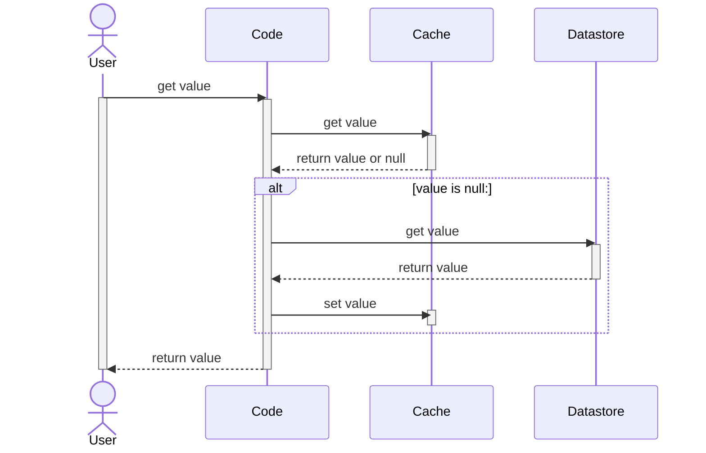
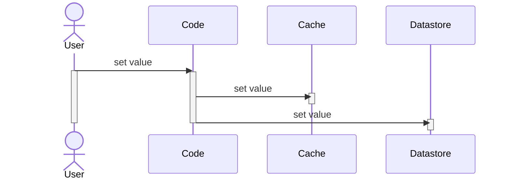
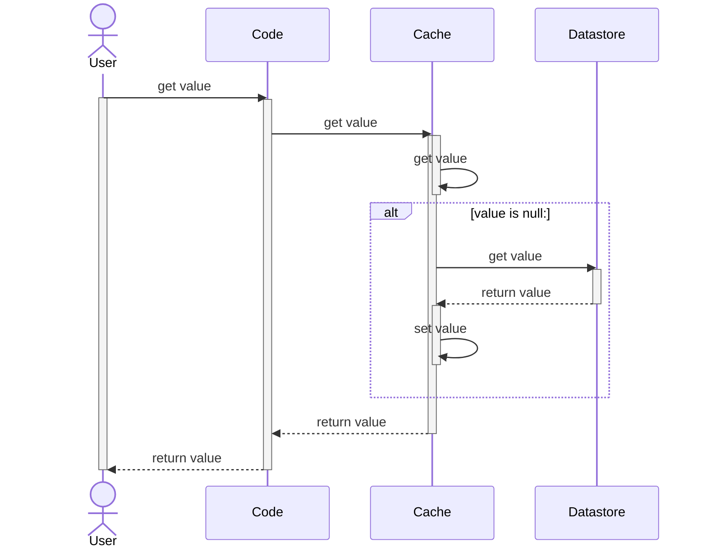
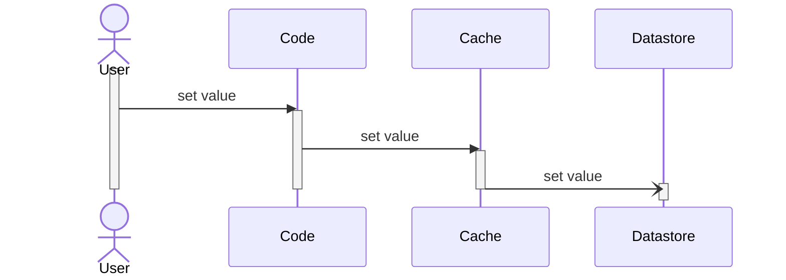
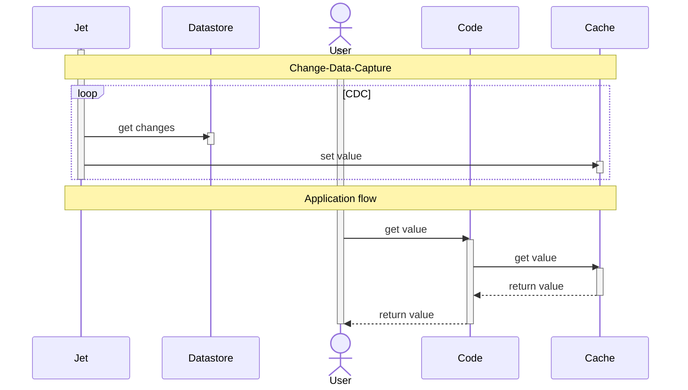

当你的服务开始变慢时，通常是在执行链中的某个环节出现了性能瓶颈。有时这个瓶颈可能是一个Bug导致的，有时可能是没有使用最佳的配置导致的，有时也可能是在请求外部数据时导致的。

对于请求外部数据导致的性能瓶颈来说，可以考虑一种权衡：不要每次需要数据时都从远程读取它，而是在第一次读取后，就把它存到本地。这就是缓存（Cache），使用缓存，你就需要在**过期数据（stale data）与执行效率（speed）** 之间做权衡。

决定使用缓存仅仅是这个旅程中的开始，下一步你需要思考，你的应用程序该如何与缓存进行交互。

<!--more-->

## Cache-Aside

Cache-Aside应该是最常用的缓存模式了，中文一般称为“旁路缓存”。在这种模式下，你的代码来负责缓存数据与原始数据的交互流程。

当**读取请求**发生时，它的流程如下所示：

当**写请求**发生时，流程会相对简单：

Cache-Aside的最大优点是代码流程简介易懂，便于维护。此外，对于Cache Provider的需求很简单：它只需要能提供`set value`和`get value`的途径即可，这一特点让你在替换Cache Provider时非常方便。

这一方式的缺点则是，你需要在代码中自行解决Cache和Datastore之间数据不一致的情况：例如你成功的将数据更新到了Cache中，但是在更新Datastore时失败了，你的代码可能需要实现失败重试的机制来解决这个问题，但你可能还得考虑，在失败重试的过程中，Cache中是存在Datastore中没有的数据的，这会对你的系统产生什么业务是上的影响吗？

而且，即使调整Cache和Datastore的更新顺序，也是无济于事的，因为还是会出现Datastore更新成功，但是Cache更新失败的情况。

## Read-Through

Read-Through中文称为“读穿透”，在查询数据时，如果缓存中不存在数据，则先从数据源中获取并放入缓存，然后返回给应用程序。相比Cache-Aside来说，Read-Through将从Datastore获取数据的职责，从Code层转移到了Cache层。

Read-Through实现了关注点分离原则（Separation of Concerns principle）。现在，代码层只需要与Cache进行交互。Cache与Datastore之间的数据同步，由Cache自身控制。相对于Cache-Aside模式，Read-Through对Cache Provider提出了更高的要求。

> Hazelcast提供了MapLoader用于Read-Through模式  

## Write-Through

Write-Through中文称为“写穿透”，在数据更新时同时更新缓存，确保数据一致性。类似Read-Through，但是针对的是写场景的解决方案。它将写数据的职责转移给了Cache Provider。

Write-Through的主要优势是你无需在代码中进行错误处理和重试逻辑了，因为它现在由Cache完成。

> Hazelcast提供了MapStore接口用于Write-Through模式。因为在大多数情况下，Write-Through也隐含了Read-Through，MapStore是MapLoader的子接口，因此与Datastore的交互部分的代码是在同一个类中的。

## Write-Behind

Write-Behind中文称为“写后缓存”，延迟将数据写入缓存，以提高写入性能。它看起来非常像Write-Through。

大部人可能看不出来这个流程与Write-Through之间的差异，仔细观察可以发现，最后一个流程的箭头发生了变化：从实心箭头变成了空心箭头。在UML建模中，它表示Cache发送了一个异步消息到Datastore中。

就目前而言，actors之间所有消息的交换都是同步进行的：调用方在继续执行下一步之前，需要等待被调用方完成处理并返回。而在Write-Behind模式下，Cache将数据交给Datastore后直接完成，不会等待Datastore的确认。

从好的方面来看，这种方式提升了整个流程的速度，因为通常来说Datastore是最耗时的一个组件 —— 它位于网络中的某个位置并写磁盘。另一方面，它也带来了数据不一致的风险。在Write-Through模式中，发生异常时你可以不断重试，直到它成功为止，而在Write-Behind模式中，你完全不知道它是否成功。

> 使用Hazelcast，从Write-Through模式转变为Write-Behind模式，只需要调整`write-delay-seconds`配置为一个大于0的值即可。

## Refresh-Ahead

Refresh-Ahead中文称为“预取刷新”，在数据即将过期时，异步刷新缓存中的数据。有句老话说得好，计算机科学中有两件最难的事情：命名和缓存失效（cache invalidation）。缓存失效是指，在缓存中的数据过期之前，它计划在缓存中存储多长时间。当缓存过期或缓存为空时，你需要使用Cache-Aside或Read-Through模式从Datastore中获取它。

两种模式都围绕Code, Cache, Datastore实现了各自的数据处理逻辑。就像之前提到的，从Datastore读取数据是一个非常昂贵的操作：你需要先通过网络请求连接Datastore，然后读取数据。如果你可以做到预读数据，甚至在你发请求之前就让它可用，从而避免你在关键路径上遭受性能损失。这就是Refresh-Ahead要做的事情。

Refresh-Ahead的实现依赖Cache Provider。（译注：原文的意思是直接无脑选择Hazelcast Jet就行了，安全有保障）。使用Hazelcast Jet的Change-Data-Capture能力，Jet允许使用public API连接到任意的Cache Provider中，并且能够做到，Datastore发生变化，就会同步数据到Cache中。下面是CDC的简要时序图：

## Summary

|Pattern|Consider|Cons|
|--|--|--|
|Cache-Aside|当Cache Provider能力有限时|你的应用承担协调缓存与真实数据的流程|
|Read-Through|-|-|
|Write-Through|-|-|
|Write-Behind|对性能要求更新，能够容忍短期内可能出现的不一致性|异步系统带来的复杂性|
|Refresh-Ahead|当从Datastore抓取数据时影响了吞吐量|需要额外开发、部署和维护|
